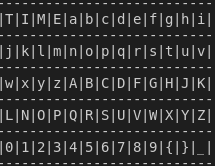

# Momma says to play fair
### Category: Cryptography
### Author: Christina He

## Description
We received an encrypted message from deep space. We think that someone is trying to smuggle a flag
away from Omni-Flags. Decrypt the message to get one step closer to success!

Here is the message: nEctTfwcH8P08nv4w{K0jT3Zn2K2A88k{Y

Good luck!

Key Table

## Hint
1. I have modified the key table to be 13 by 5

## Solution
Playfair cipher follows the following rules:
1. If there are repetition of a letter, a bogus word, in this scenario "X" is added in between
2. If the number of characters in the message is odd, a bogus word will be added at the end of the message
3. The message will be broken down into pairs
4. If the letters in the pair is in the same row in key table, each of them shifts one column to the right.(Or to the first column if the letter is at the end of the row)
5. If the letters in the pair is in the same column in key table, each of them shifts one row down. (Or to the first row if the letter is at the bottom of the column)
6. If the letters in the pair are not in the same row or column, each letter shifts to the coloum of the other letter in the same row.

To decrypt the message, we only need to reverse of the process:
1. Break down the cipher text into pairs
2. If the letters in the pair are not in the same row or column, each of them shifts ot the coloum of the other letter in the same row.
3. If the letters in the pair are in the same column, each of them shifts one row up.
4. If the letters in the pair are in the same row, each of them shifts one column to the left.
5.  Remove any bogus letter in the message.

Check out sol.py for solution

## Flag
magpie{L34rn_H0w_T0_Pl4y_F41r}
